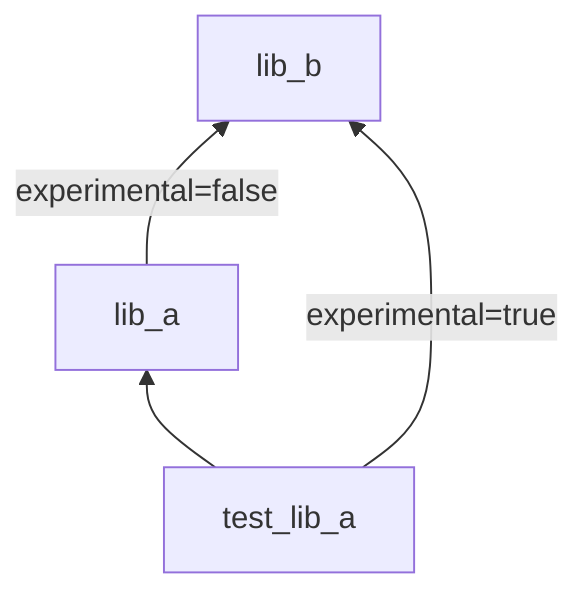

## Minimal sample to reproduce Rust dependency issue. 

### Build steps

```bash
$ cd test_lib_a/
$ cargo --version
cargo 1.73.0 (9c4383fb5 2023-08-26)
$ cargo build --verbose # Currently fails with following error:
Running `.rustup/toolchains/stable-aarch64-apple-darwin/bin/rustc --crate-name lib_a --edition=2021 git/rust_sandbox/config_libs/lib_a/src/lib.rs --error-format=json --json=diagnostic-rendered-ansi,artifacts,future-incompat --diagnostic-width=120 --crate-type lib --emit=dep-info,metadata,link -C embed-bitcode=no -C debuginfo=2 -C split-debuginfo=unpacked -C metadata=67690df7da0fe262 -C extra-filename=-67690df7da0fe262 --out-dir git/rust_sandbox/config_libs/test_lib_a/target/debug/deps -C incremental=git/rust_sandbox/config_libs/test_lib_a/target/debug/incremental -L dependency=git/rust_sandbox/config_libs/test_lib_a/target/debug/deps --extern lib_b=git/rust_sandbox/config_libs/test_lib_a/target/debug/deps/liblib_b-e851de457b7cb519.rmeta`
error[E0412]: cannot find type `BType` in crate `lib_b`
 --> git/rust_sandbox/config_libs/lib_a/src/lib.rs:6:24
  |
6 |     pub b_type: lib_b::BType,
  |                        ^^^^^ not found in `lib_b`
  |
note: found an item that was configured out
 --> git/rust_sandbox/config_libs/lib_b/src/lib.rs:5:12
  |
5 | pub struct BType {}
```

### Dependency graph: 



Problem: Is there a way to build `test_lib_a` so that `lib_b` is always used with the `experimental` feature turned on.

Solution (!!): Add an `experimental_a` flag (name doesn't matter) to `lib_a`, which in turns enables the `experimental` feature on `lib_b`. See [this commit](https://github.com/jumaffre/rust_sandbox/commit/d0a41d2a9e401bc8d599034d2845d4febeaff6ef).